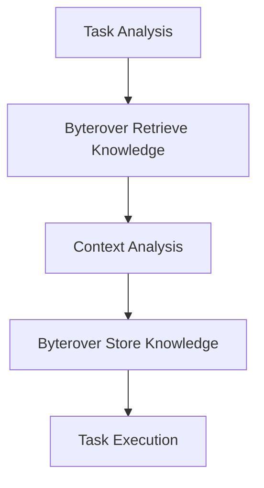
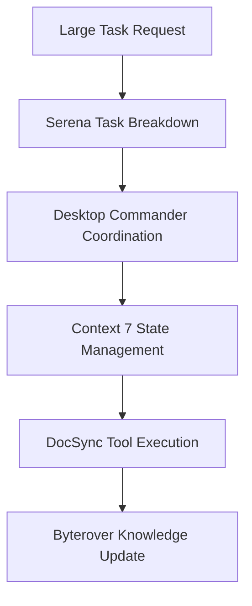

# 🤖 MCP Workflow Integration Plan

## 🎯 Objective

Integrate MCP tools (Serena, Byterover, Desktop Commander, Context 7) into the workflow to handle large tasks more effectively.

## 🔧 Available MCP Tools Analysis

### 1. **DocSync Tools** (mcp/docsync.yaml)

- `listDocuments`: List available documents
- `convertDocxToMd`: Convert Word → Markdown
- `exportMdToDocx`: Export Markdown → Word
- `autoSync`: Smart sync based on modification time
- `toPptx`: Export Markdown/HTML → PowerPoint
- `toPdf`: Export Markdown/HTML → PDF
- `readMarkdown`: Read full file or specific section
- `updateMarkdown`: Replace specific section in Markdown
- `applyAiEdit`: AI-powered surgical editing

### 2. **Byterover Knowledge Tools**

- `byterover-retrieve-knowledge`: Retrieve stored knowledge
- `byterover-store-knowledge`: Store knowledge for future use

### 3. **Serena Tools**

- Project management and memory storage
- Code analysis and symbol navigation
- File operations and search
- Memory system for project context

### 4. **Desktop Commander**

- System-level operations
- Task coordination
- Multi-tool workflow management

### 5. **Context 7**

- Maintain context across complex workflows
- State management for long-running tasks
- Context preservation between sessions

## 🚀 Integration Strategy

### Phase 1: Knowledge Management Integration



### Phase 2: Task Coordination Workflow



## 🛠️ Implementation Plan

### 1. **Knowledge Management Integration**

- **Before Task Execution**: Use `byterover-retrieve-knowledge` to gather relevant context
- **After Task Completion**: Use `byterover-store-knowledge` to store learned patterns
- **Continuous Learning**: Store error solutions, debugging techniques, and reusable patterns

### 2. **Serena Dashboard Monitoring**

- Set up Serena dashboard at <http://127.0.0.1:24283/dashboard/index.html>
- Configure project memories for task tracking
- Use Serena's symbol navigation for code analysis

### 3. **Desktop Commander Configuration**

- Configure for system-level operations
- Set up multi-tool workflow coordination
- Enable task parallelization where appropriate

### 4. **Context 7 State Management**

- Establish context preservation mechanisms
- Configure state management for long-running tasks
- Set up session persistence

### 5. **DocSync Tool Integration**

- Use document conversion tools for content processing
- Leverage AI editing capabilities for content improvement
- Implement smart sync for document version management

## 📋 Workflow Examples

### Example 1: Large Document Processing Task

```
1. User: "Process all documents in docs/ folder"
2. System: 
   - Use Byterover to retrieve previous document processing patterns
   - Use Serena to analyze document structure
   - Use Desktop Commander to coordinate batch processing
   - Use DocSync tools for conversion and formatting
   - Use Context 7 to maintain state across documents
   - Store new patterns in Byterover knowledge base
```

### Example 2: Complex Code Refactoring

```
1. User: "Refactor the entire codebase for better performance"
2. System:
   - Use Byterover to retrieve refactoring patterns
   - Use Serena for code analysis and symbol navigation
   - Use Desktop Commander for multi-file coordination
   - Use Context 7 to maintain refactoring state
   - Store successful refactoring patterns in Byterover
```

## 🎯 Benefits of Integration

### 1. **Improved Task Handling**

- Break down large tasks into manageable steps
- Maintain context across complex workflows
- Preserve state for long-running operations

### 2. **Enhanced Knowledge Management**

- Learn from previous task executions
- Store and retrieve error solutions
- Build a knowledge base of reusable patterns

### 3. **Better Coordination**

- Multi-tool workflow management
- Parallel task execution where possible
- System-level operation support

### 4. **Context Preservation**

- Maintain state across sessions
- Preserve context for interrupted tasks
- Enable resumption of complex workflows

## 📊 Success Metrics

- **Task Completion Rate**: Measure improvement in completing large tasks
- **Knowledge Reuse**: Track usage of stored knowledge patterns
- **Context Preservation**: Measure ability to resume interrupted tasks
- **Coordination Efficiency**: Track reduction in task coordination overhead

## 🔄 Continuous Improvement

1. **Feedback Loop**: After each task, analyze performance and update workflow
2. **Knowledge Expansion**: Continuously store new patterns and solutions
3. **Workflow Optimization**: Refine coordination based on task outcomes
4. **Context Enhancement**: Improve state management based on usage patterns

## 🚀 Next Steps

1. **Immediate Implementation**: Integrate Byterover knowledge tools into current workflow
2. **Short-term**: Set up Serena dashboard and configure Desktop Commander
3. **Medium-term**: Establish Context 7 state management
4. **Long-term**: Create comprehensive documentation and training materials

This integration will significantly enhance the ability to handle large, complex tasks by leveraging the full power of the MCP ecosystem.
