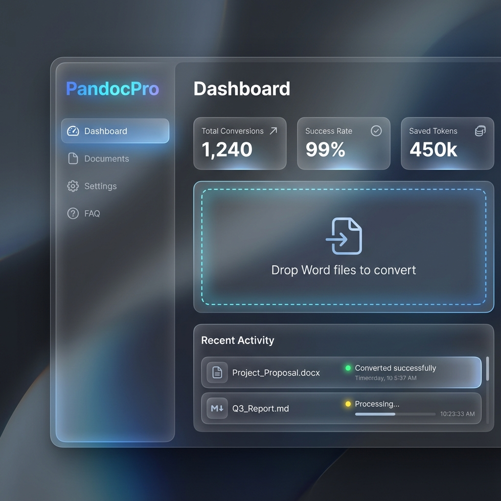
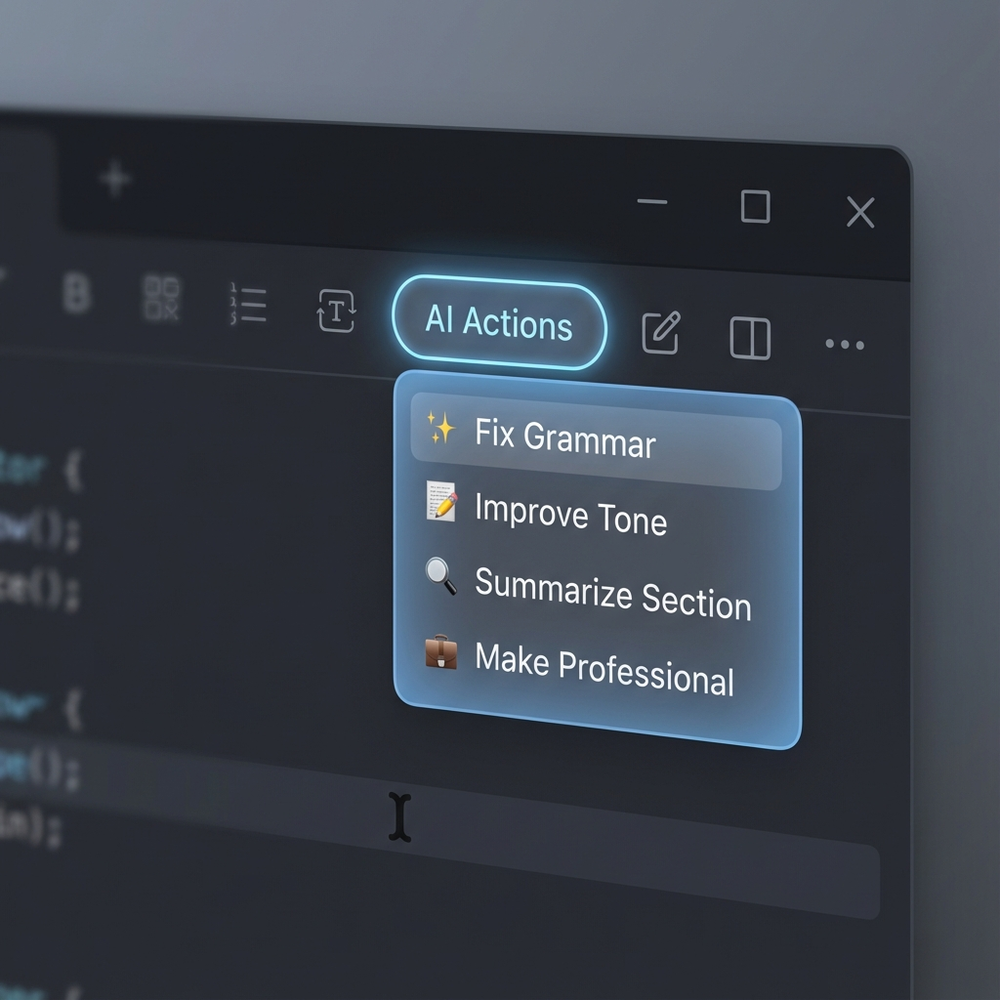

# 🚀 PandocPro
### *AI-powered long-document editing — private, fast, and built for real workflows.*

PandocPro is a local-first writing and editing tool that lets you convert, improve, and manage large Word and Markdown documents **without token limits, formatting issues, or privacy risks**.

Work section-by-section. Use local LLMs. Keep everything on your device.  
Perfect for writers, agencies, researchers, and anyone producing long or sensitive documents.

---

## 🌟 Why PandocPro?
Most AI tools collapse when you give them a 40-page brief, a client report, or a technical document. PandocPro solves this by creating a **clean, predictable, private document workflow** around AI.

You’ll download PandocPro because you want:

- **AI assistance without exposing private files**
- **Long-document editing without token or context limits**
- **Clean DOCX ↔ Markdown transitions**
- **Precise section-based editing and improvements**
- **A workflow you can trust, not a hacky workaround**
- **A desktop app (with a `.dmg`) you can install and run instantly**

PandocPro is built for people who write or edit professionally — not for quick notes.

---

## 🎯 Core Value in One Sentence
**PandocPro makes AI practical for serious documents — privately, locally, and without breaking your formatting.**

---

## 🔥 Key Features at a Glance

### 🧭 Clean Word ↔ Markdown Workflow
PandocPro uses Pandoc under the hood for conversions.  
Expect:  
- Full structure retention  
- Proper headings & lists  
- Reliable round-trip exports  
- Zero formatting surprises  

### ✂️ Section-based Editing for Long Documents
Instead of feeding a 20,000-token document to an AI:  

- Select a section  
- Ask for improvements  
- Update just that part  

That means:  
- No token issues  
- No broken formatting  
- 70–90% fewer tokens per edit  
- Higher control, lower risk  

### 🤖 Targeted AI Improvements  
Use AI for:  
- Tone adjustments  
- Grammar, clarity, style polishing  
- Summaries or rewrites  
- Structural edits or expansions  

Each AI call affects only what you select. The rest of the document stays intact.

### 🛡️ Privacy-first: Local or Cloud LLMs, Your Choice  
Work entirely offline using local LLMs (Ollama, LM Studio, Qwen, etc.).  
Cloud usage remains optional — only when you choose.  

Ideal for:  
> - Client deliverables under NDA  
> - Legal, financial, academic, or sensitive documents  
> - Internal reports or company-only content  

### 🖥️ GUI + CLI + MCP — Work How You Want  
#### GUI  
- Intuitive dashboard  
- Drag & drop import/export  
- Live status of DOCX ⇆ MD sync  
- Presets (Academic, Business, Blog)

#### CLI (for power users)  
- `dsync` tools for automation  
- Scriptable workflows  

#### MCP Support  
Integrate with MCP-enabled tools (ChatGPT, Claude, etc.) — trigger conversions, edits or exports directly from your AI assistant.  

### 📦 Ready-to-Use Installer for macOS  
We provide a `.dmg` installer — no build steps, no dependency pain.  
Download → install → start working.

---

## 🧑‍💻 Who PandocPro Is For

- Agencies producing proposals, decks, client reports  
- Technical writing and documentation teams  
- Researchers and academics  
- Legal, financial, and consultancy professionals  
- Anyone writing or editing 10–100+ page documents  
- Anyone wanting AI editing **without risking privacy**  

---

## 🧩 Feature Overview

| Category   | Features |
|------------|----------|
| Conversion | DOCX ↔ Markdown via Pandoc, template support, clean exports |
| Editing    | Section-based edits, targeted improvements, tone/style changes, summaries |
| AI         | Local & optional cloud LLM support, precise control, safe editing |
| Workflow   | Watch mode, smart sync, conflict handling, export management |
| Interfaces | GUI, CLI, MCP — flexible for any user style |
| Privacy    | Local-first, optional cloud, no forced uploads |
| Distribution | Ready-to-use macOS `.dmg`, scriptable CLI install/build |

---

## 🖼️ Visual Preview





---

## 🧩 Requirements

PandocPro runs locally on macOS and relies on the following tools:

- **Pandoc** (required for DOCX ↔ Markdown conversion)  
  ```bash
  brew install pandoc
  ```

- **Node.js** (required for the CLI, MCP tools, and running the Electron app)
  ```bash
  brew install node
  ```

- **Ollama** (optional, but recommended if you want fully private, local AI editing)
  ```bash
  brew install --cask ollama
  ollama pull llama3
  ```

- **Xcode Command Line Tools** (optional — only needed if you plan to build PandocPro from source or compile native dependencies)
  ```bash
  xcode-select --install
  ```

PandocPro works entirely on your device with local LLMs, cloud models, and MCP-enabled editors.
Install the required tools above before running the app.

---

## 📥 Download / Install

### ✅ macOS (recommended)  
Download the latest `.dmg` installer from the Releases tab — install and run in seconds.

### 💻 From Source (all platforms)

```bash
git clone https://github.com/motacola/PandocPro.git  
cd PandocPro  
npm install  
npm run gui:dev   # for development  
# or  
npm run gui:build  # creates production build (dmg / zip)
```

---

## ⚙️ CLI Quick Start

**Convert DOCX → Markdown:**

```bash
dsync convert document.docx
```

**Improve a section:**

```bash
dsync improve document.md --section 3 --prompt "Tighten tone and improve clarity"
```

**Export back to DOCX:**

```bash
dsync export document.md --output final-version.docx
```

---

## 🔄 Watch & Auto Sync

- Live watch (auto-export on save):
  ```bash
  DOCX_FILE=docs/presentation.docx MD_FILE=docs/presentation.md npm run watch
  ```
  Use `--mode=to-pdf|to-html|to-pptx` to change outputs; `--once` runs a single export and exits.
- Auto mode (newest file wins):
  ```bash
  ./scripts/docx-sync.sh docs/report.docx docs/report.md auto
  ```
- Keep Markdown + Word twins ready: drop `.docx` files in `docs/`, run `dsync` option 1 once, then leave watch mode running while you edit.

## 🚢 Release Flow (when to cut a new DMG)

1) Ensure Pandoc + PPTX writer are installed (or CI installs them). Run `npm test` (smoke + UI server tests).  
2) For server-only changes, no DMG is needed; for GUI/electron changes, run:
   ```bash
   npm run gui:build   # production build
   npm run gui:package # opens gui/release with the DMG
   ```
3) Smoke the drag-and-drop UI: `npm run ui` and convert a small `.md` → `.docx`/`.pdf`.  
4) Tag and publish only when both smoke tests and GUI packaging succeed.

## 🔗 MCP Quick Start (for LLM-integrated workflows)

Works with **Desktop Commander**, **Context7**, and any other MCP-aware client.

```bash
# Easiest: one-step installer
./scripts/install-mcp.sh

# Optional: if your client is launched outside the repo, set PROJECT_ROOT
# export PROJECT_ROOT="/absolute/path/to/docx-md-sync"
```

Restart your MCP client so it discovers the `docsync` tools, then ask:
“Convert report.docx to markdown, improve the introduction, and export to Word.”

Common client setups:
- Desktop Commander (Claude Desktop): restart the app after copying the YAML.
- Context7: reload the workspace/client so it rescans `~/mcp/tools`.
- Other MCP clients (VS Code extension, custom CLIs): point them at the same `~/mcp/tools/docsync.yaml`; set `PROJECT_ROOT` if they launch outside the repo.

---

## ❤️ Why Users Love PandocPro
- Saves time on long-form editing
- Makes AI editing reliable and controlled
- Keeps documents private and local
- Eliminates formatting issues
- Enables professional workflows for serious documents
- Combines editing, AI, and export in one tool

---

## 📣 Contributing & Feedback

Pull requests and contributions welcome!
Create templates, presets, or automation scripts — drop them into `/templates` or `/scripts`, and submit a PR.

---

## 📄 License

MIT
