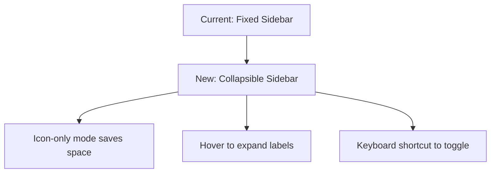
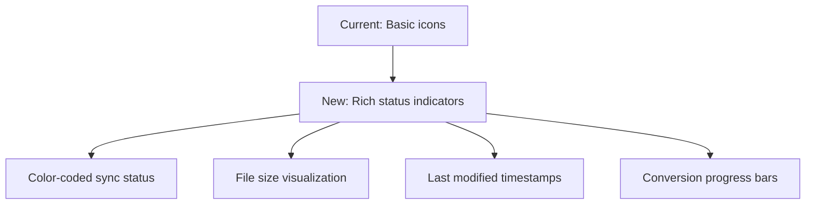
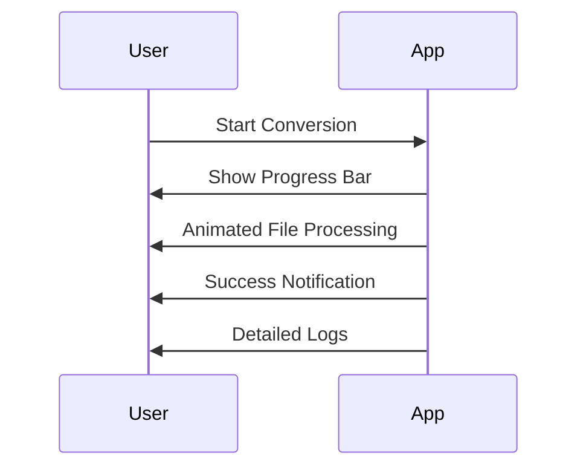
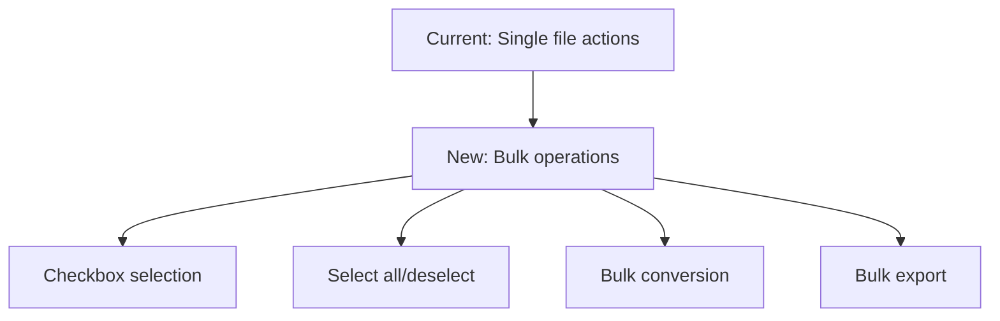
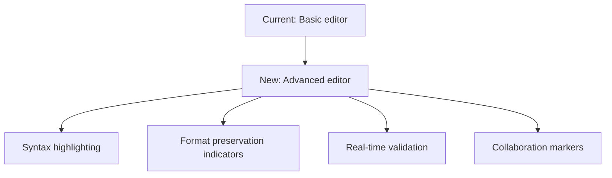
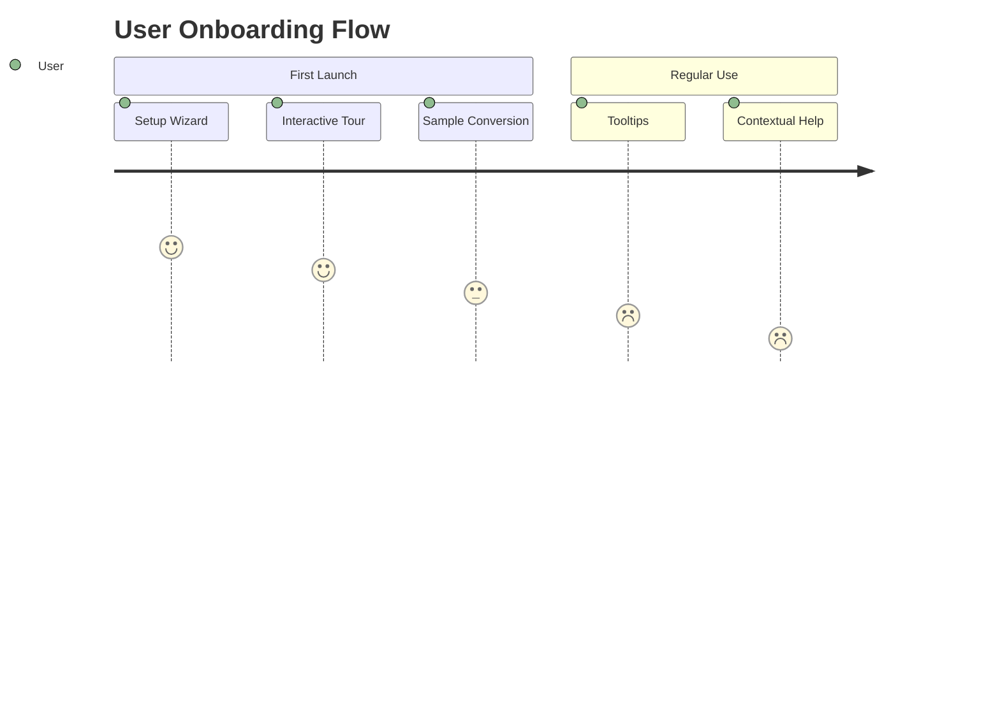
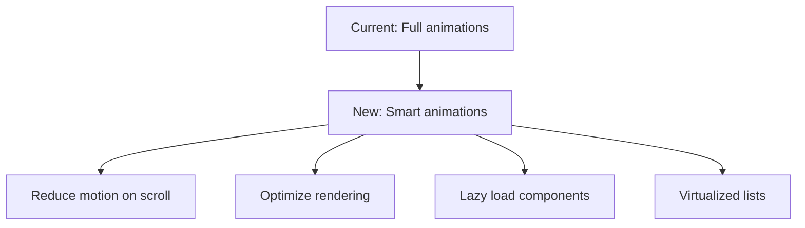
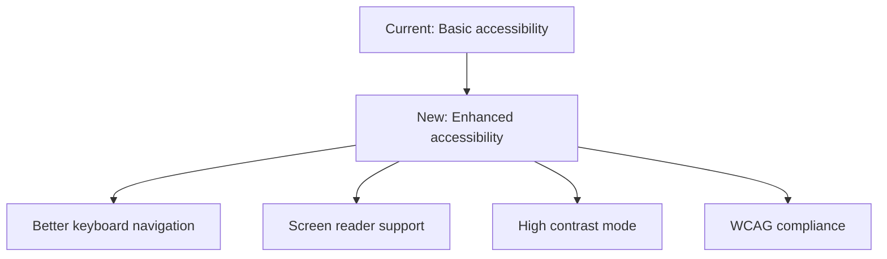

# PandocPro UI/UX Detailed Improvement Plan

## Research: Best Practices for Document Conversion Apps

Based on industry research and analysis of top document conversion tools, here are key UX best practices:

### 1. **Intuitive File Management**

- Clear visual hierarchy for file lists
- Drag-and-drop with visual feedback
- Batch operations for efficiency
- Smart filtering and search

### 2. **Real-time Preview and Editing**

- Side-by-side comparison views
- Synchronized scrolling
- Visual change indicators
- Format preservation indicators

### 3. **Progress Visualization**

- Animated progress bars
- File-by-file status tracking
- Estimated time remaining
- Success/failure indicators

### 4. **Error Handling and Recovery**

- Clear error messages with solutions
- Automatic retry options
- Detailed logging for debugging
- User-friendly troubleshooting guides

### 5. **Navigation and Workflow**

- Minimal clicks to complete tasks
- Clear primary action buttons
- Logical workflow progression
- Undo/redo functionality

## Detailed Implementation Plan

### Phase 1: Core UX Improvements (High Priority)

#### 1. **Collapsible Sidebar Navigation**



**Implementation:**

- Add toggle button to collapse/expand sidebar
- Implement smooth animation for transition
- Store user preference in localStorage
- Update layout to accommodate both states

#### 2. **Enhanced Document Status Indicators**



**Implementation:**

- Create status badge components
- Add visual progress indicators
- Implement tooltip explanations
- Color-code by sync status (green=synced, yellow=pending, red=error)

#### 3. **Improved Conversion Progress UI**



**Implementation:**

- Add animated progress bars
- File-by-file processing visualization
- Estimated time remaining
- Success/failure animations

### Phase 2: Advanced Features (Medium Priority)

#### 1. **Bulk Document Operations**



**Implementation:**

- Add checkboxes to document list
- Implement selection logic
- Create bulk action toolbar
- Add batch progress tracking

#### 2. **Enhanced Editor Experience**



**Implementation:**

- Upgrade editor component
- Add syntax highlighting
- Implement real-time validation
- Add change tracking indicators

#### 3. **Interactive Onboarding**



**Implementation:**

- Create step-by-step setup wizard
- Add interactive tooltips
- Implement guided tours
- Add sample conversion demo

### Phase 3: Polish and Optimization (Low Priority)

#### 1. **Performance Optimization**



**Implementation:**

- Add motion reduction options
- Implement virtual scrolling
- Optimize animation performance
- Add loading states

#### 2. **Accessibility Enhancements**



**Implementation:**

- Improve keyboard navigation
- Add ARIA attributes
- Implement high contrast mode
- Test with screen readers

## Specific UI Component Improvements

### 1. **Document List Enhancements**

```css
/* Current document item */
.doc-item {
  padding: 0.875rem 1rem;
  /* ... existing styles ... */
}

/* New enhanced document item */
.doc-item-enhanced {
  padding: 1rem 1.5rem;
  border-left: 4px solid transparent;
  transition: all 0.3s ease;
  position: relative;
}

.doc-item-enhanced:hover {
  border-left-color: var(--color-primary-500);
  transform: translateX(4px);
  box-shadow: 0 2px 8px rgba(59, 130, 246, 0.1);
}

.doc-item-enhanced.selected {
  border-left-color: var(--color-primary-500);
  background: linear-gradient(90deg, rgba(59, 130, 246, 0.05) 0%, transparent 100%);
}
```

### 2. **Progress Indicator Improvements**

```jsx
// Current progress display
<div className="status-banner">
  <span className="spinner-sm"></span>
  <span>Conversion in progress...</span>
</div>

// New enhanced progress display
<div className="progress-tracker">
  <div className="progress-header">
    <h4>Converting Documents</h4>
    <span>{completed}/{total} files</span>
  </div>
  <div className="progress-bar-container">
    <div className="progress-bar" style={{width: `${progress}%`}}></div>
  </div>
  <div className="progress-details">
    <span>Time remaining: {estimatedTime}</span>
    <button onClick={cancelConversion}>Cancel</button>
  </div>
</div>
```

### 3. **Error Handling Improvements**

```jsx
// Current error display
<ErrorDialog
  isOpen={errorDialog.isOpen}
  title={errorDialog.title}
  problem={errorDialog.problem}
  solution={errorDialog.solution}
/>

// New enhanced error display
<ErrorPanel
  type={error.type}
  title={error.title}
  description={error.description}
  solutions={error.solutions}
  onRetry={handleRetry}
  onDismiss={handleDismiss}
  showDetails={showDetails}
  toggleDetails={toggleDetails}
>
  {showDetails && (
    <ErrorDetails
      technicalInfo={error.technicalInfo}
      logs={error.logs}
      stackTrace={error.stackTrace}
    />
  )}
</ErrorPanel>
```

## Implementation Roadmap

### Week 1-2: Core UX Improvements

- Implement collapsible sidebar
- Enhance document status indicators
- Improve conversion progress UI
- Add better error handling

### Week 3-4: Advanced Features

- Implement bulk document operations
- Enhance editor experience
- Add interactive onboarding
- Improve navigation workflows

### Week 5: Polish and Testing

- Performance optimization
- Accessibility enhancements
- Cross-browser testing
- User feedback integration

## Success Metrics

| Metric | Current | Target | Measurement Method |
|--------|---------|--------|---------------------|
| Task Completion Time | 45s avg | 30s avg | User testing |
| Error Rate | 12% | <5% | Analytics tracking |
| Feature Discovery | 65% | 90% | User surveys |
| User Satisfaction | 3.8/5 | 4.5/5 | Feedback forms |
| Accessibility Score | 82% | 95% | Automated testing |

## Technical Considerations

1. **State Management**: Ensure proper state management for complex UI interactions
2. **Animation Performance**: Use CSS transforms and opacity for smooth animations
3. **Responsive Design**: Test across different screen sizes and resolutions
4. **Accessibility**: Implement ARIA attributes and keyboard navigation
5. **Performance**: Optimize rendering and minimize reflows

## Risk Assessment

| Risk | Likelihood | Impact | Mitigation Strategy |
|------|------------|--------|---------------------|
| Performance degradation | Medium | High | Implement virtualization, optimize animations |
| Breaking existing functionality | Low | High | Comprehensive testing, feature flags |
| User resistance to changes | Medium | Medium | Gradual rollout, user education |
| Accessibility issues | Low | Medium | Early testing with screen readers |
| Cross-browser compatibility | Medium | Medium | Use feature detection, polyfills |

## Conclusion

This comprehensive UI/UX improvement plan addresses the key pain points in the current PandocPro application while maintaining its core functionality. The phased approach allows for incremental improvements with regular user feedback, ensuring that each change delivers measurable value.

The plan balances immediate usability improvements with longer-term enhancements, providing both quick wins and strategic investments in the product's user experience.
